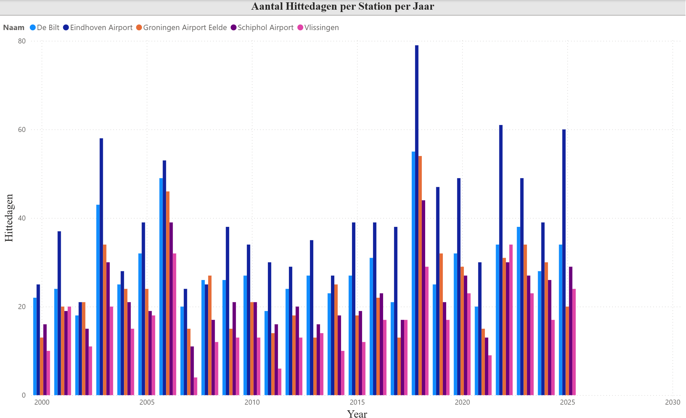

# KNMI Weather Data Exploration

With this project I wanna further solidify my SQL knowledge by querying KNMI weather data and get some nice insights on weather patterns over the period 2000-2026.

## Database

I used PostgreSQL (version 18.3) for the database design.

The following tables were created:

- fact_weather
- dim_date
- dim_station

So I essentially went for a Star Schema, as it allows for better and more interesting queries. 

For this project I decided to only pick the 5 most important weather stations that, together, cover all regions of the netherlands:

- De Bilt
- Schiphol Airport
- Groningen Airport Eelde
- Vlissingen
- Eindhoven Airport

Quick summary of the data:

| Station Name            | Entries | Start Date | End Date   |
|-------------------------|---------|------------|------------|
| De Bilt                 | 9497    | 2000-04-01 | 2026-04-01 |
| Eindhoven Airport       | 9497    | 2000-04-01 | 2026-04-01 |
| Groningen Airport Eelde | 9497    | 2000-04-01 | 2026-04-01 |
| Schiphol Airport        | 9497    | 2000-04-01 | 2026-04-01 |
| Vlissingen              | 9497    | 2000-04-01 | 2026-04-01 |

## Workflow
1. Set up a local PostgreSQL database. 
2. Create SQL tables by running schema.sql
3. Perform some explorative queries in folder /src
4. Create some extra visualisations in Power BI

## Level 1 Insights: Aggregates

- Across all stations it seems that the average temperatures are rising over the period 2001-2025
- 2010 was signifcantly colder than all other years (across all stations)
- From 2021 and onward, the temperatures are significantly higher than previous years (more heatwaves during summer?)
- When it comes down to the wettest months over the past 25 years, most of them are either september or august'
- Across these 5 stations, the hottest temperature ever recorded was 40.4 degrees Celsius at Eindhoven Airport
- Across these 5 stations, the coldest temperature ever recorded was -19.7 degrees Celcius at Eindhoven Aiport

## Level 2 Insights: Groupby

- As Eindhoven is the most souther station and most inland, there is less of a cool-down effect from the sea, and thus we see the most warm days (>25 degrees Celsius) over there. 
- 2018 seems to be the hottest year across all stations except vlissingen (based on warmest days). If you only look at the overall average of the year, 2018 ranks as second hottest year.
- Surprisingly, Vlissingen has less rainfall than I initially expected. But looking at the science of wind movement and directions it makes sense that De Bilt and Schiphol Airport absorb most of the train. 
- Vlissingen has the highest amount of sunshine hours across all stations. This has to do with the fact that it is a coastal station, and thus tends to have less cloudy weather. 
- Something that baffled me completely: Spring was not even part of the results for query 4. This means spring in the Netherlands is considered the most dry season by a significant margin. 

## Level 3 Insights: Window Functions
- The biggest difference in temperatures between 2 neighbouring years seems to be measured in 2013-2014 and 2010-2021 (across all stations).
- For De Bilt and Eindhoven Aiport the hottest summer was measured in 2018. For Groningen Airport it was 2019, for Schiphol airport it was 2025, and finally for Vlissingen it was measured in 2022. 

## Level 4 Insights: CTEs
- The warmest summers are found in 2018, 2022, and 2003. I personally have no recollection of the 2003 one (I was merely 3 years old), but apparently there was a big European heatwave. 
- When it comes to rainfall it shows that 2025 has the biggest extremes (very little rainfall), but if we look at the amount of stations that reported little rainfall, 2018 seems to be the driest year.
- The longest (local) heatwave measured in the netherlands was in the east of our country (Eindhoven and surroundings), and lasted 28 days (2018). 
- If we look at "extreme" weather (defined by a formula using max temperature, precipitation and average windspeed), Vlissingen station seems to have recorded the most extreme weather instances. This can probably be explained by the fact that it is a coastal station and thus has might higher windspeeds on average during the entire year (despite this station not measuring the most rainfall, as seen in previous queries). 

## Power BI Insights: Warm Days

For the purpose of this project I have defined a warm day as a day where the max temperature was higher than 25°C. The visualisation above shows the amount of warm day per year per station over the period 2000-2025.

2018 seems to be the most extreme, with Eindhoven Airport counting almost 80 warm days in total. It makes sense that Eindhoven Airport shows the most extremes at is located in the south and more inland compared to the other stations. 

For vlissingen and Schiphol, the extremes are consistently lower, which is to be explained by the moderation effect of the sea lowering overall temperatures. 

The most concerning trend over this period is the fact that we are seeing a higher amount of total warm days in the more recent years, which is in line with climate change science. 

## Limitations

Because I couldnt download all weather data from all stations located in the Netherlands (too many results - had to cut the parameters), I decided to go for the 5 weather stations to cover all regions. 

For a more thorough analysis, it is recommended to obtain more data from different weather stations.